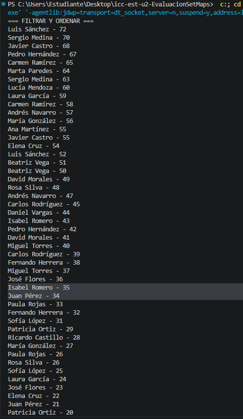
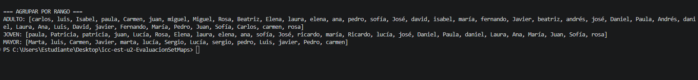

# Explicación del proyecto

## Método A

Se utilizó la implementación TreeSet<Persona> ya que permite mantener los datos ordenados automáticamente y eliminar duplicados.

El comparador devuelve 0 cuando el nombre o la edad es igual, manteniendo la unicidad.

La lógica ordena la edad de manera descendente y filtra las personas con edad mayor o igual al umbral, si la edad es igual ordena por nombre ascendente ignorando mayúsculas. Eso hace que TreeSet conserve solo una instancia.

## Método B

Se utilizón la implementación TreeMap<String, List<String>> debido a que mantiene las claves ordenadas alfabéticamente.

Las claves junto a sus calsificaciones usadas fueron:
- ADULTO - edad < 30
- JOVEN - 30 <= edad < 60
- MAYOR - edad > 60

Cada grupo almacena solo nombres. Se usa HashSet auxiliar para guardar los nombres únicos por grupo. El orden de aparición se conserva usando ArrayList.

